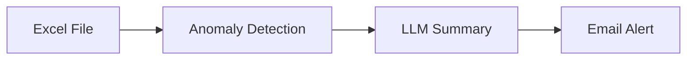

# Anomaly Detection Agent

This detection system reads a business's daily metrics, calculates a z-score for each one, and flags anomalies. Once an anomaly is detected, it triggers the alert system and sends an email 
summarizing what happened.

## Overview

This project looks for outliers by calculating a z-score for each metric in the data. A metric is flagged as an anomaly if its z-score exceeds a threshold of 3 (in either direction — a spike 
or a drop).

If any anomalies are found, the agent uses an LLM to write a short summary explaining what likely happened, connecting related metrics where relevant, and suggesting a next step to investigate.

The agent is scheduled to run automatically every day at 9 AM. If anomalies are found, it sends an email alert. This automates the work of manually reviewing the data, writing a summary, and 
sending the alert yourself.

## Architecture

The Excel file contains: Date, Website_Sessions, Conversion_Rate_%, Orders, Avg_Order_Value_$, Revenue_$, Marketing_Spend_$, New_Customers, and Support_Tickets.

`agent.py` first loads the Excel file into a DataFrame using the pandas library. Each column is treated as a metric, and a rolling 14-day z-score is calculated for it. If a metric's absolute 
z-score exceeds the threshold of 3, it's flagged as an anomaly.

All flagged anomalies are collected and passed to an LLM (Claude Sonnet 4.5, via the Anthropic API), which generates a short summary of what likely happened and suggests a next step to investigate.

Once the summary is generated, the agent builds an email with the anomaly count as the subject and the summary as the body, and sends it via Gmail's SMTP server.

## Tech Stack

- Python
- Pandas
- Claude API
- Gmail SMTP
- Cron

## Setup / Installation

1. Clone the repo
2. Create a virtual environment
3. Install dependencies: `pip install -r requirements.txt`
4. Create your own `.env` file based on `.env.example`, with your own Anthropic API key and Gmail App Password

## How to Run It

Run `python agent.py`. As long as your `.env` file is set up with your own credentials (see Setup above), no code changes are needed.

The agent is also scheduled via a cron job, so it runs and checks for anomalies automatically at a set time every day, without needing to be run manually.

## Future Improvements

- Currently, the data file has to be loaded manually — I'd like to automate ingestion (e.g. via Snowpipe) so new data is picked up as it lands.
- There's currently a single alert threshold — this could be extended to a two-tier system, logging smaller anomalies while only emailing on more significant ones.
